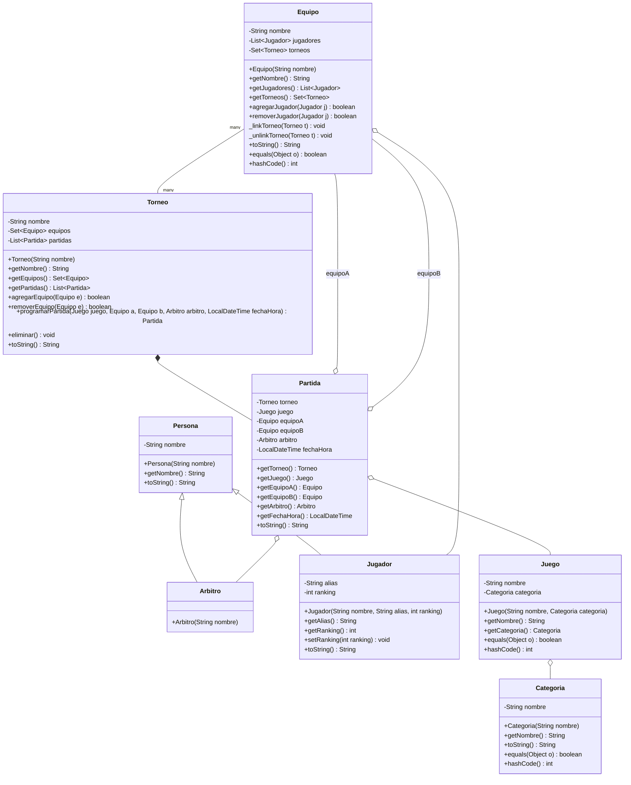

Una organización quiere desarrollar un sistema para gestionar torneos de videojuegos (eSports). Este sistema se encargará de manejar equipos, jugadores, juegos, torneos y partidas.
## Requisitos del sistema:
- Un torneo está compuesto por varias partidas (matches). Si el torneo se elimina, sus partidas también.
- Cada partida se juega entre dos equipos y está asociada a un juego (por ejemplo, LoL, CS:GO, etc.).
- Un equipo está compuesto por varios jugadores. Si el equipo se elimina, los jugadores no se eliminan (pueden ser asignados a otro equipo).
- Cada jugador tiene un nombre, alias y ranking.
- Cada juego tiene una categoría (FPS, MOBA, etc.). Las categorías existen por separado del juego.
- Un árbitro supervisa cada partida. Un árbitro puede supervisar muchas partidas, pero una partida tiene un solo árbitro.
- Un equipo puede participar en varios torneos, y un torneo puede tener varios equipos.
## Instrucciones de la Actividad:
- Investiga los tipos de relaciones en diagramas de clases UML:
  - Asociación
  - Composición
  - Agregación
  - Herencia
  - Multiplicidad / cardinalidad (1:1, 1:N, N:M).
  - Analiza el caso de estudio del Sistema de Gestión de Torneos de eSports.
  - Elabora un diagrama de clases UML donde representes las entidades (Torneo, Partida, Equipo, Jugador, Juego, Categoría, Árbitro), sus atributos y relaciones.
- Defiende tu propuesta en la siguiente sesión, explicando las relaciones y
mostrando cómo se representarían en Java mediante clases, atributos y
referencias.

# Diagrama

